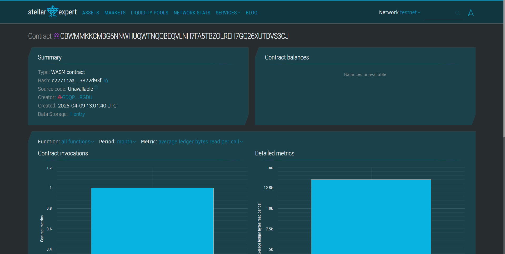

# 🌐 DAO Governance Smart Contract – Stellar Soroban

This project is a **DAO Governance System** built using **Rust on Stellar Soroban**, enabling decentralized decision-making within a community through proposals and voting.

---
## Project Description

This project implements a comprehensive DAO governance system that enables community members to propose, vote, and execute collective decisions in a transparent and trustless manner. The smart contract provides infrastructure for decentralized decision-making without intermediaries, ensuring secure participation and tamper-proof execution of governance actions.

Built on the Stellar blockchain using Soroban SDK, the contract creates a framework for managing decentralized communities, funds, or protocol upgrades. The system features customizable governance parameters, democratic voting mechanisms, and transparent execution processes.

## Contract Address:
CBWMMKKCMBG6NNWHUQWTNQQBEQVLNH7FA5TBZOLREH7GQ26XUTDVS3CJ

## 🚀 Key Features

### 🏛️ Decentralized Governance
- Any active community member with enough voting power can **propose changes**.
- Decisions are made based on **majority voting** from active DAO members.

### 🗳️ Proposal System
- Members can create proposals (e.g., funding, rule changes).
- Voting is open for a fixed time after a delay.
- Proposals are finalized and executed based on vote outcomes.

### 🔐 Role-Based Access
- Only the **admin** can add or remove members, and change governance settings.
- **Members** can vote or propose based on their voting power.

### ⏱️ Timelocks
- Proposal voting starts after a **voting delay** and lasts until the **voting period** ends.
- **Execution** can only happen after proposal approval and a short delay (timelock).

### 📦 Persistent Storage
- DAO state (members, proposals, votes) is stored using **Soroban’s contract storage**, ensuring data consistency across contract calls.

---

## 🔧 Main Functions

### `initialize(admin, settings)`
Initializes the contract with the admin and basic governance settings.

### `add_member(member, voting_power)`
Adds a new DAO member with specified voting power.

### `remove_member(member)`
Deactivates a DAO member (they can’t vote or propose anymore).

### `update_member_voting_power(member, new_power)`
Updates an existing member’s voting power.

### `create_proposal(id, title, description)`
Allows a qualified member to create a proposal if they meet the threshold.

### `cast_vote(proposal_id, vote_type)`
Lets active members vote **For**, **Against**, or **Abstain** on a proposal.

### `finalize_proposal(proposal_id)`
Marks a proposal as passed or defeated based on vote count and quorum.

### `execute_proposal(proposal_id)`
Executes a passed proposal after the timelock period ends.

### `get_governance_settings()`
Returns current DAO parameters like quorum, voting period, etc.

### `is_active_member(member)`
Checks if a member is currently active.

---

## ✅ Use Case

This contract is ideal for communities, clubs, or Web3 platforms that want:
- Transparent voting
- Secure member management
- Rule-based decentralized execution
- On-chain decision tracking

